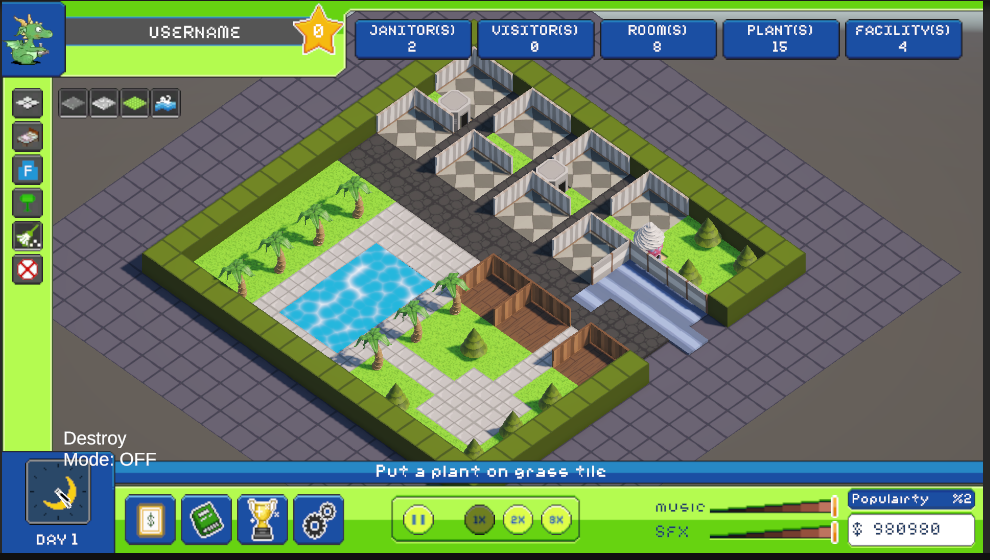
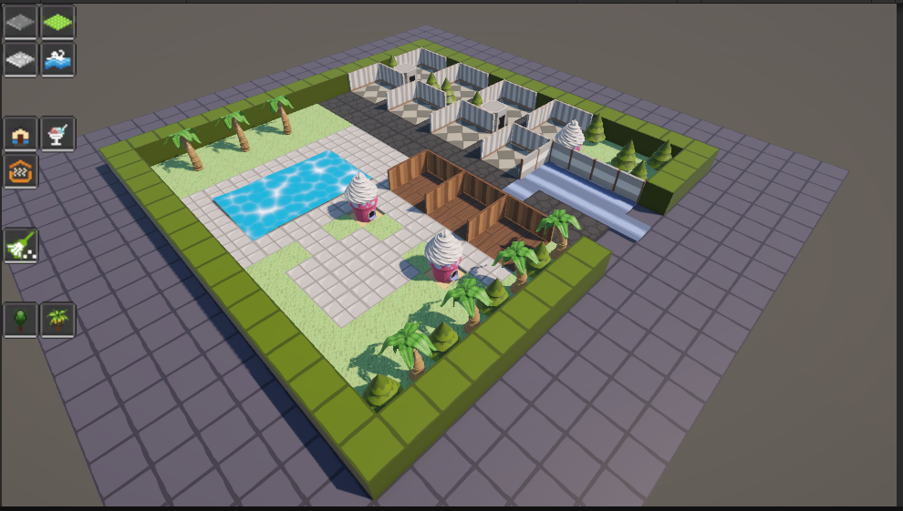

# [5-4-2026] Alpha Version 0.3  
  
- Added `GameManager.cs` to handle main/general game events:  
    - Added balance and added costs to structures.  
    - Added the destroy mode.  
- Prevent structures from being placed when mouse is on the UI.  
- refractored `building` to `structure` for the whole project.  
- Added UI elements with logic in `HUDManager`:
    - Top Bar: profile and statistics.  
    - Left Bar: menus.  
    - Bottom Bar: statistics and quests.  
    - `PanelSlider.cs`: structure menu animations.  
- Added Cursor collision with objects to `PlayerCamera.cs` to make structures clickable.  
- Added `Structures.cs` as an universal scripts to house the data for each structure instance.  
- Added `isWater` and `isInteractable` properties to `Tile.cs`.  

# [4-4-2026] Alpha Version 0.2  
  
- Added `isWalkable` property to structures.  
- Removed unused libraries.  
- Hardcoded lobby as occupied tiles.  
- Moved ghost logic from `PlayerCamera.cs` to `GhostIndicator.cs`.  
- Added more structures:  
    - Tile (Diorite).  
    - Water (+ shaders).  
    - Sauna.  
    - Tree (Palm).  
    - Tree (Pine).  

# [3-4-2026] Alpha Version 0.1  
  
- Created `GhostIndicator.cs` script to handle ghost indicator.  
- Added grass tile:  
    - Added `isGrass` and `canPlaceOnGrass` properties.  

# [2-4-2026] Alpha Version 0.0  
- Initial version, readme & screenshot.  